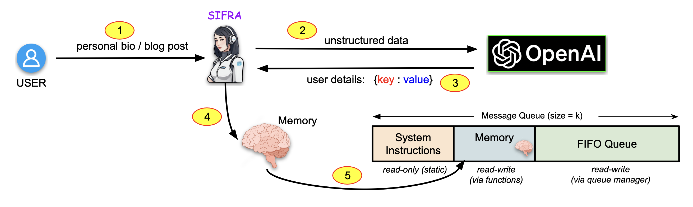
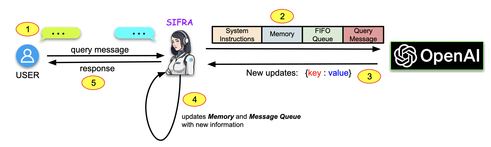

# SIFRA 

SIFRA (Super Intelligent & Friendly Responsive Agent) is a personalized AI agent designed to revolutionize the way users interact with technology. By leveraging generative AI techniques, this AI agent can understand and remember user details and preferences from unstructured data sources, providing a highly tailored and engaging conversational experience. Whether it is remembering your favorite hobbies or deducing preferences from blog posts, the Mem0 AI Assistant ensures that every interaction feels personal and intuitive.

SIFRA has the following capabilitites:

1. **Unstructured Data Handling:** Seamlessly input various unstructured data sources, such as blog post content, personal bios, and more, into the AI Assistant.
2. **Automatic Profiling:** Automatically deduce relevant user details and preferences from the ingested data. Moreover, it  builds and updates personalized user profiles based on continuous data input.
3. **Personalized Interactions:** Recall and leverage user profile information to provide responses that are contextualized and highly personalized.
4. **Adaptive Learning:** Continuously learn and adapt to user preferences to enhance the conversational experience over time.

## Framework Overview

SIFRA's framework is majorly divided into two phases: (1) Initiation Phase and (2) Episode Phase. 

### Phase-1


### Phase-2


## Features

## ⚙️ Dependencies and Installation

Firstly, you need to clone this repository in order to access SIFRA. You can do so py running the following command in your terminal.

```
git clone https://github.com/prateekchhikara/ai-assistant
```

The required dependencies are present in the file ```requirements.txt```.

Before proceeding, you must need to add some API-keys in a ```.env``` file in the directory of sifra. There are 4 keys which are required to run SIFRA. You can find the example .env file in the directory.

```
LANGCHAIN_API_KEY = ""
OPENAI_API_KEY = ""
OPENAI_BASE_URL = "https://api.openai.com/v1"
OPENAI_ORGANIZATION = ""
```


There are two ways in which SIFRA can be accessed.

### 1. CLI

A python package is created though which SIFRA-cli can be accessed. The user just needs to install the package using the following command. Running the command will install the required dependencies in your local.

```
pip install sifra
```

After the installation has been completed. Run ```sifra``` in your terminal.


### 2. GUI


## 🚀 Quick Demo Examples


## 🎓 References